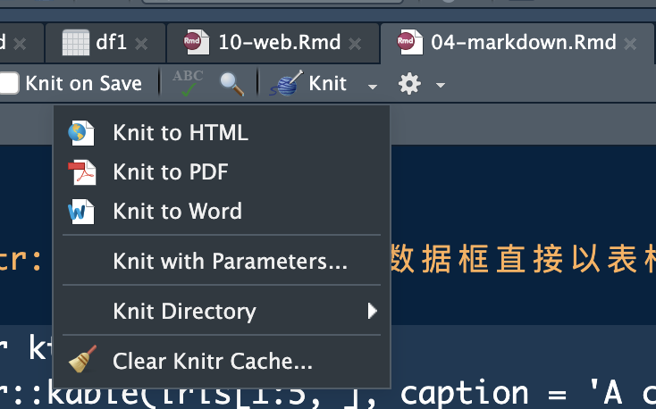
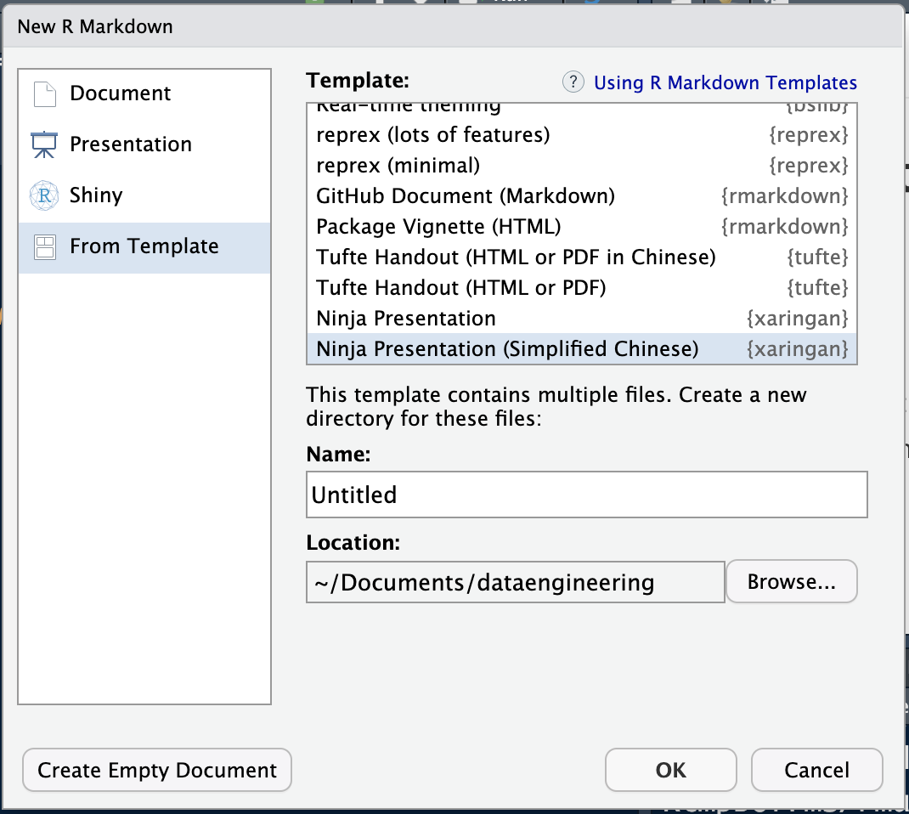
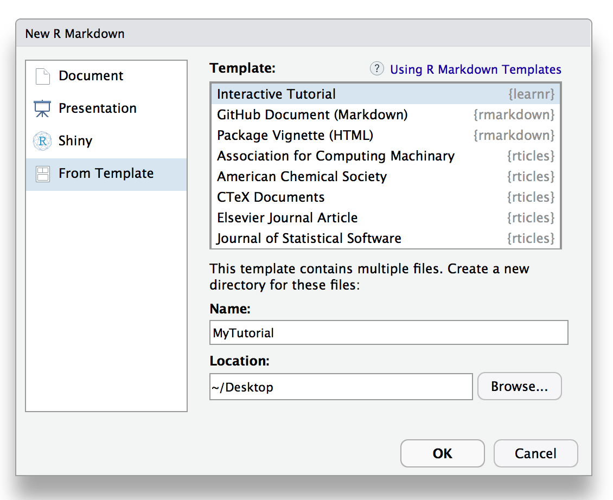
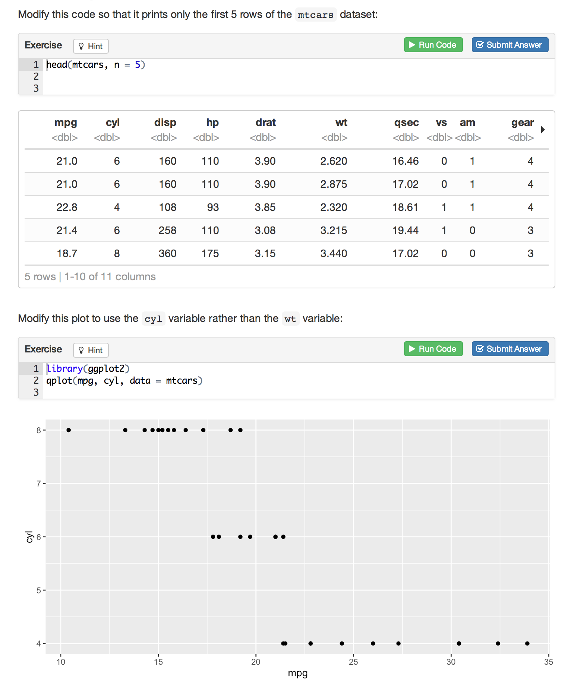
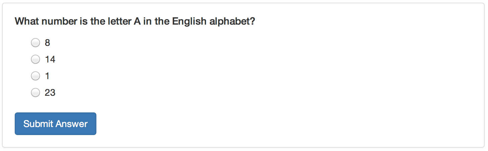

> 他要是体面，你就让他体面；他要是不体面，你就帮他体面。*---让子弹飞*

可复现性是数据工程誓死捍卫的底线原则与科学研究区分于巫术的主要特征。R语言内嵌了一整套自动化报告解决方案，可以保证结果可复现。另一方面，任何数据分析报告都不是一蹴而就的，必然涉及到反反复复的结果调试，R语言自动化报告可以帮我们避免反复将分析结果赋值粘贴到Word文档里面（如果你不理解这句话，那说明你还不是一个资深数据分析人员），避免了这种愚蠢的重复劳动。我们一直认为懒没有错，因为懒是推动人类寻找更高效技术方案的原生动力，自动化报告就是这样的技术方案。

## 什么是文学式编程

文学式编程是相对于结构式编程而言的。结构式编程就是我们前面学到的那些循环、分支结构、函数等代码，让计算机按照我们的设定去执行特定任务。但是在展示这些运算结果的时候，我们还需要将其编辑到一个文档或者演示文稿中。文学式编程则是将这两步融合在一起，分析报告的正文和代码放入同一个文档，编译的时候分别运行，从而一次性生成分析报告。

文学式编程起源于大神Knuth开发的Sweave框架，大名鼎鼎的Tex就是其作品。写到这里，忍不住要提到Tex开发的故事，当年Knuth老人家不满出版社的排版质量，一气之下写了一套高质量排版系统，并写支票奖励发现缺陷的人，奖金都是16进制的1美元，而且金额随缺陷数目递增（这段轶事大神谢益辉的书籍中也有记载）。

2011年，R语言社区大神谢益辉（我在课上把他称为华人之光）由于忍不了Sweave的图片宽度设置等问题，一气之下（又来！）开发了knitr包（具体这段历史可以参考谢益辉自己的[回忆](https://bookdown.org/yihui/r-ninja/auto-report.html)^[R语言忍者秘笈 https://bookdown.org/yihui/r-ninja/ ]），兼容并无限拓展Sweave，把我们从LaTex的深坑中拯救了出来。读到这里，如果你还没有体会过LaTex的坑有多深，那么恭喜你，你可以不用体会，直接跳入RMarkdown的简洁世界吧。

上面的故事也告诉我们，如果你想推动技术进步，就让程序员生气吧，忍无可忍的程序员总会搞出一些惊天动地的事情。

## Markdown格式

`Markdown`格式是最简洁的带格式的文本语法。`Markdown`是John Gruber于2004年开发的，使用一组非常简洁的符合人类阅读习惯的标签来实现大部分文本文档中的格式，大量被程序开发人员使用。

### 标题

标题使用`#`加空格的形式表示，几级标题就用几个`#`表示。由于本文是使用markdown语法写作的，因此就不演示编译后结果了。

```
# 一级标题
## 二级标题
### 三级标题
#### 四级标题
```

### 段落文本

段落可以是一行或者多行文字，不同段落之间用空行分割。`*`之间的文本为*斜体*，两个`*`之间的文本为**加粗**，三个以上`*`表示分隔符，使用`-`表示无序列表，使用`1.`表示有序列表，可以通过制表符来进行列表分级。通过`[](link)`来表示引用，link表示超链接地址。

例如，
```
后来我就念了**两首诗**[^2],

[^2]: 纪念一位逝去的长者

> 苟利国家生死以，岂因祸福避趋之

他回忆说：“*一个人的命运啊，当然要靠自我奋斗，但是也要考虑到历史的行程。*”

***

人固有一死，

- 或重于泰山
- 或轻于鸿毛
  - 或介于中间

更多关于markdown知识可以参考markdown手册和Rstudio的文档， 以及[Xie, Allaire, and Grolemund 2019](https://bookdown.org/yihui/rmarkdown/)。
```

后来我就念了**两首诗**[^2],

[^2]: 纪念一位逝去的长者

> 苟利国家生死以，岂因祸福避趋之

他回忆说：“*一个人的命运啊，当然要靠自我奋斗，但是也要考虑到历史的行程。*”

***

人固有一死，

- 或重于泰山
- 或轻于鸿毛
  - 或介于中间

更多关于markdown知识可以参考markdown手册和Rstudio的文档， 以及[Xie, Allaire, and Grolemund 2019](https://bookdown.org/yihui/rmarkdown/)。

### 表格

表格使用`|`分割不同的列，多个`-`区分表头与表格，并搭配`:`表示对齐方式，列宽度与输入的列标题下横线宽度成比例。例如：

```
| Covariates                                                | Mean      |           | Difference | P value |
| --------------------------------------------------------- |:---------:| --------- | ----------:| -------|
|                                                           | Acceptors | Rejectors |            |         |
| PhD from globally top-100 STEM program                    | 0.525     | 0.551     | −0.026   | 0.701   |
| Research productivity before return                       |           |           |            |         |
|   Articles per year                                       | 2.390     | 2.932     | −0.541   | 0.098   |
|   First-authored articles per year                        | 1.003     | 1.058     | −0.055   | 0.658   |
|   First-authored articles in top 10% of journals per year | 0.523     | 0.403     | 0.119      | 0.040   |
|   Last-authored articles per year                         | 0.196     | 0.608     | −0.412   | 0.000   |
|   Last-authored articles in top 10% of journals per year  | 0.046     | 0.202     | −0.156   | 0.001   |
| Overseas faculty appointments                             | 0.136     | 0.890     | −0.755   | 0.000   |
| Research funding per year ($1000 in 2010 USD)             | 4.439     | 30.365    | −25.925  | 0.006   |
Table: Table 1. YTT offer receiver comparison.(Shi et.al., 2023)[^3]

[^3]: Dongbo Shi et al. ,Has China’s Young Thousand Talents program been successful in recruiting and nurturing top-caliber scientists?.Science379,62-65(2023).DOI:10.1126/science.abq1218

```

| Covariates                                                | Mean      |           | Difference | P value |
| --------------------------------------------------------- |:---------:| --------- | ----------:| -------|
|                                                           | Acceptors | Rejectors |            |         |
| PhD from globally top-100 STEM program                    | 0.525     | 0.551     | −0.026   | 0.701   |
| Research productivity before return                       |           |           |            |         |
|   Articles per year                                       | 2.390     | 2.932     | −0.541   | 0.098   |
|   First-authored articles per year                        | 1.003     | 1.058     | −0.055   | 0.658   |
|   First-authored articles in top 10% of journals per year | 0.523     | 0.403     | 0.119      | 0.040   |
|   Last-authored articles per year                         | 0.196     | 0.608     | −0.412   | 0.000   |
|   Last-authored articles in top 10% of journals per year  | 0.046     | 0.202     | −0.156   | 0.001   |
| Overseas faculty appointments                             | 0.136     | 0.890     | −0.755   | 0.000   |
| Research funding per year ($1000 in 2010 USD)             | 4.439     | 30.365    | −25.925  | 0.006   |
Table: Table 1. YTT offer receiver comparison.(Shi et.al., 2023)[^3]

[^3]: Dongbo Shi et al. ,Has China’s Young Thousand Talents program been successful in recruiting and nurturing top-caliber scientists?.Science379,62-65(2023).DOI:10.1126/science.abq1218

实际上，对于比较已经有`MS Excel`文件的表格，可以使用在线工具将其直接转化为`Markdown`语法，例如<https://tool.lu/tables>.

### 图片

``用于添加图片，方括号内是图片的标题，可以空缺，圆括号内是图片的地址，可以是网页图片也可以是本地图片。

```

```


或者

```

```


### 代码块

使用单个上标顿号\`可以在文本行内标注代码代码引用，使用三个\`可以将整个段落设置为代码块。

段落代码块使用时，可以在三个\`后用`{}`来标记代码块使用的编程语言。

```{r}
library(readr)
```

### 数学公式

使用单个`$`可以在文本行内应用Tex语法来编辑数学公式，两个`$`可以生成数学公式段落。例如，

```
$$
\beta_{1} = \frac{\Sigma_{1}^{n}(x_{i}-\bar{x})(y_{i}-\bar{y})}{\Sigma_{1}^{n}(x_{i}-\bar{x})^2}
$$
```

$$
\beta_{1} = \frac{\Sigma_{1}^{n}(x_{i}-\bar{x})(y_{i}-\bar{y})}{\Sigma_{1}^{n}(x_{i}-\bar{x})^2}
$$

除此之外，`Markdown`还可以兼容`HTML`，在网络上可以找到丰富的学术资源拓展学习。

更有趣的是大部分的网页编译器都允许`Markdown`语法，例如<https://editor.mdnice.com/>可以通过`Markdown`语法来编辑文档，然后转化成微信公众号或知乎支持的富文档。


## Rmarkdown

基于`knitr`包，R在Markdown语法的基础上，将运算代码和预算结果嵌入到文本当中，并做了针对性的设计，拓展名为`.Rmd`。`Rmarkdown`由三个部分组成，分别是YAML, 文本部分以及代码块。

### YAML头文件

Rmarkdown的头文件使用YAML格式，用`---`包围起来。通过参数设置,可以控制比如输入格式,输出主题等等。

典型的YAML文件如下：

```
---
title: "Untitled"
author: "Dongbo Shi"
date: "2023-10-13"
output: html_document
---
```

### 代码块控制

在代码块的`{}`中通过`参数=取值`的方式来控制代码块在文档中的功能与呈现方式。为了更好区分不同的代码块，可以在`{r}`之后添加一个标签，例如`{r setup}`，只有标签是可以不指定参数名的。

常用参数如下：

|参数|说明|
|:-----|:-----------|
|`eval`|是否运行代码，也可用向量指定运行代码的行数|
|`echo`|是否在文档中显示代码，也可用向量指定显示代码的行数|
|`results`|显示文本输出的方式，`markup`用标记语言显示，`asis`显示原始文本，`hold`表示代码运行结束之后统一输出文本，`hide`表示隐藏文本结果|
|`collapse`|是否将代码块合并|
|`warning`|是否输出警告信息|
|`message`|是否输出运行信息|
|`include`|是否将代码结果输出到文档，当`FALSE`时，代码依然运行，但是不输出结果|
|`error`|是否在代码运行报错是停止编译markdown，缺省值是`TRUE`|
|`comment`|注释的标注方式，默认为`#`|
|`background`|代码块的背景颜色|
|`cache`|是否缓存代码，当`TRUE`时，代码在第二次编译时不重复运行|
|`fig.x`|系列参数设置图片输出的格式|
|`file`|调用外部R代码|

可以在文档开头通过一个代码块设置全局参数，例如，

````{set}

```{r setup, include = FALSE}
  knitr::opts_chunk$set(
    comment = '', fig.width = 6, fig.height = 6
  )
```

````


### Rmarkdown特殊语法

`knitr::include_graphics`函数可以在Rmarkdown直接插入图片。且可以设置图片的宽度、高度、对齐等。

````{fig1}
```{r, eval = TRUE, fig.show = 'hold', out.width = '50%', fig.align = 'center', fig.cap = 'Rlogo'}
knitr::include_graphics('Rlogo.png')
```
````

```{r fig2, echo = FALSE, eval = TRUE, fig.show = 'hold', out.width = '50%', fig.align = 'center', fig.cap = 'Rlogo'}
knitr::include_graphics('Rlogo.png')
```


`knitr::ktable`函数可以将数据框直接以表格的形式嵌入在文档中，

```{r ktb, eval = TRUE}
knitr::kable(iris[1:5, ], caption = 'A caption')
```


更详细的资料可以参考<https://bookdown.org/yihui/rmarkdown-cookbook/>。

### 格式转换
Rmarkdown默认的编译结果为HTML文件，且可以通过`Knit`可以Rmd文件转换为PDF与Word文件。

```{r knit, echo = FALSE, eval = TRUE, fig.show = 'hold', out.width = '50%', fig.align = 'center'}

```

## Xaringan

`Xaringan`是谢益辉基于`Rmarkdown`开发了制作幻灯片的扩展包。

### 安装与模板

安装之后，可以直接在Rstudio中通过模板新建Xaringan幻灯片。

```{r xrg, echo = FALSE, eval = TRUE, fig.show = 'hold', out.width = '50%', fig.align = 'center'}

```


```{r nj, echo = FALSE, eval = TRUE, fig.show = 'hold', out.width = '50%', fig.align = 'center'}
knitr::include_graphics('ninjia.png')
```

### 其他学习资源

Xaringan模板中自带了其基本语法，读者通过模板自学。这里我们分享几个不包含在Xaringan中的学习资源。

第一个是`Xaringan`模板`NHSRthemes`，这个模板的设计是非常简洁美观的，感兴趣的可以通过安装其拓展包学习，<https://spcanelon.github.io/xaringan-basics-and-beyond/nhsr-theme/sample-16-9.html#1>

第二个是`xaringanExtra`拓展包为`Xaringan`添加了包括动画在内的各种效果，使得其更接近ms powerpoint的功能。资源为<https://pkg.garrickadenbuie.com/xaringanExtra/#/slide-tone>

第三个是2021年的一个会议，详细介绍了如何通过定制化CSS对幻灯片进行美化。<https://presentable-user2021.netlify.app/materials/act-01/03-xaringan-extras/>

第四个是一个制作精良的slides，可以参考其中具体的语法。<https://arm.rbind.io/slides/xaringan.html#1>

## leanr

R社区最新开发了一个工具`learnr`，可以应用`Rmarkdown`制作交互性教程。

### 安装与模板

通过`install.packages("learnr")`安装learnr包之后，Rstudio会嵌入learnr模板。

```{r learnr, echo = FALSE, eval = TRUE, fig.show = 'hold', out.width = '50%', fig.align = 'center'}

```

### 互动代码模块

learnr兼容所有的Rmarkdown语法，通过设置代码块的参数exercise=TRUE，可以在文本文档中生成可以编辑的代码框，这将让文档变成可交互运行的。

```{r exercise, echo = FALSE, eval = TRUE, fig.show = 'hold', out.width = '50%', fig.align = 'center'}

```

值得注意的是，learnr的不同代码块之间是独立的运行环境，是不联通的。这就导致在同一个文档中需要反复读入数据，如果要复用某个代码块的环境，可以通过exercise.setup指定已运行的环境。

例如，

````

```{r prepare-flights,message=FALSE}
library(nycflights13)
library(dplyr)
nycflights <- nycflights13::flights
```

```{r filter, exercise=TRUE, exercise.setup = "prepare-flights"}
# Change the filter to select February rather than January
filter(nycflights, month == 1)
```

```{r arrange, exercise=TRUE, exercise.setup = "prepare-flights"}
# Change the sort order to Ascending
arrange(nycflights, desc(arr_delay))
```

````

### 测试题

下面的代码可以插入随堂测验题，bi

````
```{r letter-a, echo=FALSE,eval=FALSE}
question("What number is the letter A in the English alphabet?",
  answer("8"),
  answer("14"),
  answer("1", correct = TRUE),
  answer("23")
)
```
````

```{r question, echo = FALSE, eval = TRUE, fig.show = 'hold', out.width = '50%', fig.align = 'center'}

```

参考官方文档可以了解更多关于`learnr`的功能，<https://rstudio.github.io/learnr/articles/learnr.html>

## bookdown、blogdown以及pagedown

R语言还提供了各类markdown的扩展程序，可以用于书稿写作，网页制作与网站制作等。参考资料包括：

 - <https://bookdown.org/yihui/rmarkdown-cookbook/>
 - <https://bookdown.org/yihui/bookdown/>
 - <https://bookdown.org/yihui/blogdown/>


## Quarto

为了实现一次原则，文学式编程是应该是跨语言的。尽管Rmarkdown也努力开发了跨语言编译的功能，但并不顺滑。为了更好地实现跨语言、多文件类型、多格式输出的文学式编程，POSIT（原Rstudio）集中力量推出了新一代文学式编程语言`Quarto`。

`Quarto`的野心非常大，是想一统江湖的。它可以将R、Python、Julia、Observable JS源程序的markdown文件产生运行结果后转换为各种输出格式，其扩展名即可以是扩展的markdown（`.qmd`），也可以是Jupyter笔记本文件（.ipynb）,支持HTML、MS Word、LaTeX PDF、ePub、网站、幻灯片等多种输出格式。


从这个意义上说，`Rmarkdown`仅仅是R语言文学式编程的最佳工具，而`Quarto`可能是跨语言文学式编程的最佳工具。很遗憾，我在写讲义的时候才开始接触`Quarto`，目前还不能下这个结论，等介绍完python之后，我们可以一起体会下其妙处，到时候也会扩展本节的内容。感兴趣的读者可以先阅读丰富的官方文档自学，<https://quarto.org/docs/guide/>。

最后，讲一个程序员之间流行着的一个故事。

> 每隔一段时间，总有大佬感慨于江湖上不同语言之间的纷争，以毕生所学推出一个新的语言来一统江湖，最后，江湖上的纷争又多了一种语言。


