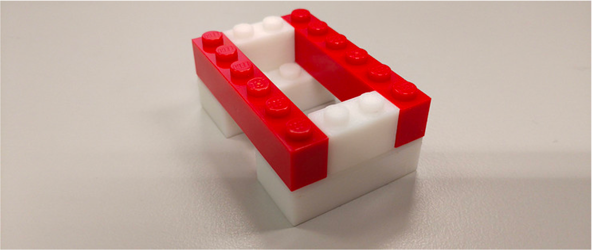

```{r setup, include = FALSE}
# remotes::install_github("mitchelloharawild/icons")
# remotes::install_github('nhs-r-community/NHSRtheme')
# load packages
library(knitr)
library(tidyverse)
library(NHSRtheme)
library(icons)
library(fontawesome)
library(xaringanExtra)
library(emo)
# set default options
opts_chunk$set(echo = FALSE,
               fig.width = 7.252,
               fig.height = 4,
               dpi = 300)
xaringanExtra::use_tile_view()
xaringanExtra::use_panelset()
# uncomment the following lines if you want to use the NHS-R theme colours by default
# scale_fill_continuous <- partial(scale_fill_nhs, discrete = FALSE)
# scale_fill_discrete <- partial(scale_fill_nhs, discrete = TRUE)
# scale_colour_continuous <- partial(scale_colour_nhs, discrete = FALSE)
# scale_colour_discrete <- partial(scale_colour_nhs, discrete = TRUE)
```

class: title-slide, left, bottom

# `r rmarkdown::metadata$title`
----
## **`r rmarkdown::metadata$subtitle`**
### `r rmarkdown::metadata$author`
### `r rmarkdown::metadata$date`

---

# 关于提交issue与其他的学习建议

* 在已关闭的issue中寻找是否已经有解决方案

* 如果没有新建issue，全面描述你的报错信息，以及尝试了什么方案

* 仅仅是截图会降低别人回答的概率

* 找到了解决方案之后，回来贴一个

* C某网站还是比较坑的，尽可能用谷歌英文搜索

* 有同学提到需要以自习+复习的方式学习本课程，这个打开方式是正确的

* 预习的话大家直接去看讲义，课件也是讲义转化来的，不要等我的课件，课件会比较晚出来

* 后续的课程视频会放在Dropbox（链接到课程主页），请大家注册后发给课程邮箱，助教会邀请大家加入共享文件夹

---

# 学习目标

--

* R语言的基础知识

--

* 通过R语言的基础知识掌握其他任何语言的基础知识

--

* 不同来源数据的校对工作

---

# 小助教福利与义务

- 课程的后台准备、学习

- 下一门课程（开个研究生的理论专题课程-科学经济学）的优先报名权

- 维护作业提交系统

- 统计与发布信息

---

# 课前准备


- 安装R与Rstudio


---

# R语言简介

- R语言来自S语言，是S语言的一个变种。

- S语言由Rick Becker, John
Chambers等人在贝尔实验室开发，著名的C语言、Unix系统也是贝尔实验室开发的。

- R是一个自由软件，GPL授权，最初由新西兰Auckland
大学的Ross Ihaka 和 Robert
Gentleman于1997年发布，R实现了与S语言基本相同的功能和统计功能。

- 现在由R核心团队开发，但全世界的用户都可以贡献软件包。

- R语言最常用的编辑器是RStudio，由Posit公司（不以盈利为目的社会企业）2011年发布的一种跨平台集成开发环境。

---

# R语言的特点

R语言具有以下特点:

-   自由软件：免费、开放源代码，支持各个主要计算机系统
-   完整的程序设计语言-基于函数和对象，可以自定义函数，调入C、C++、Fortran编译的代码
-   高级语言：代码像伪代码一样简洁、可读
-   交互性：强调交互式数据分析，支持复杂算法描述，图形功能强，出色的文学式编程组件
-   社群：统计科研工作者广泛使用R进行计算和发表算法，R有上万软件包！
-   面向数据分析的对象，具有完善的数据对象，如向量、矩阵、因子、数据集、图、树等，支持缺失值
-   统计软件：实现了经典的、现代的统计方法，如参数和非参数假设检验、线性回归、广义线性回归、非线性回归、可加模型、树回归、混合模型、方差分析、判别、聚类、时间序列分析等

总而言之，R是一个不错的编程语言，可以独立完成整套工作流程。R是统计分析、数据可视化与文学式编程等方面的最佳工具！

---

# 编程的工作方式

- `Rstudio`和`Pycharm` 叫做IDE（Integrated Development Environment）。每个语言都有一款甚至多款配套的优秀IDE，它们开发了各种效率工具，例如，语法高亮、自动补全、快捷键、错误提醒、编译和调试等，让编程更加丝滑。

- 短期内依赖IDE，程序在IDE中写，调试完成后上传到服务器，在命令行中运行。

- `WSL2`和`Terminal`是模拟一个服务器环境

- 未来要皈依到编辑器，例如`vim`或者`emacs`


---

# 组织R代码的三种方式

- 命令窗口写代码

- 脚本写代码

- RMarkdown写代码

---

# R代码的组成

- 注释，主要用于一段代码的解析，可以让阅读者（包括自己）更易理解，编程语言的注释会被编译器忽略掉，且不会影响代码的执行R语言只支持单行注释，注释符号为`#`（快捷键是`ctrl+c`）

- 代码正文，所有被执行的命令组成，特别注意的是代码的缩进影响代码的可读性

  - 代码默认逐行编译，每一行一条命令
  
  - 同一行的不同命令用`;`分割
  
  - 不同行的同一个命令需要用连接符连接或者`{}`总括

---

# 数据类型

任何计算机语言要解决的第一个问题都是以什么样的方式来储存数据。R作为一个高级语言，我们可以从研究应用的角度来理解其数据类型。

回忆一下，我们在社会科学研究设计中学到的知识，研究变量可以分为：定类变量、定序变量、定距变量和定比变量。分别对应了R语言里面的字符型、逻辑型和数值型数据。

| 变量类型 | 数据类型       |
|:---------|:---------------|
| 定类变量 | 逻辑型、字符型 |
| 定序变量 | 逻辑型、字符型 |
| 定距变量 | 数值型         |
| 定比变量 | 数值型         |
| 缺失值   | NA             |

---

# 数值型

数值型可以分为整数型和浮点型。实际操作中，大部分时间我们可以忽略这两者之间的差异。数值型直接使用数字表示，并可以进行数值运算。

```{r echo=T, eval = T}
1
3+2
pi
```

---

# 逻辑型/布尔型

逻辑型有两个值真和假，用`TRUE`和`FALSE`表示（必须大写，也可用首字母表示）。其用于表示逻辑运算的结果，在后续的数据取子集操作中会大量使用。

```{r echo=T, eval = T}
TRUE;FALSE
T;F
```


---

# 字符型

字符型是R储存文本信息的数据类型，字符型数据用`"`或者`'`引起来。

```{r echo=T, eval = T}
LETTERS
month.abb
month.name
```


---

# 字符型数据函数

`paste`函数可以将多个字符粘贴为一个字符，粘贴的分隔符由sep参数指定

```{r echo=TRUE,eval=TRUE}
paste("Hello", "World", sep = "+")
```

`nchar`函数可以计算字符的长度

```{r echo=TRUE,eval=TRUE}
nchar("Hello World")
```

---

# 字符型数据函数

注意，不同于Python，R总的字符是一个整体，无法直接取出某个元素。需要使用substr来实现该功能。

```{r echo=TRUE,eval=TRUE}
substr("Hello World",1,4)
```

---
# 缺失值

在实际研究中我们经常会遇到缺失数据的情况，R中使用`NA`来储存确实信息。

```{r echo=T, eval = T}
NA
```

---

# 数据类型判断与转换

R提供了内置的`is.`函数和`as.`函数来对数据类型进行判断与转化。

| 函数           | 作用         |
|:---------------|:-------------|
| `is.numeric`   | 数值型判断   |
| `is.integer`   | 整数型判断   |
| `is.logical`   | 逻辑型判断   |
| `is.character` | 字符型判断   |
| `is.na`        | NA判断       |
| `as.numeric`   | 转换为数值型 |
| `as.integer`   | 转换为整数型 |
| `as.logical`   | 转换为逻辑型 |
| `as.character` | 转换为字符型 |

---

# 数据类型判断与转换

注意不同类型之间的转换并不是等价的

- 除NA外所有类型都可以转换为字符型

- 只有本身就是"数字"的字符型才可以转化为数值型

- 任何数值型都可以转为逻辑型，数字`0`会转换为`FALSE`，其他数字会转换为`TRUE`；反过来，`TRUE`会转换为`1`，`FALSE`会转换为`0`

```{r 02-rbasic-datatype, echo=FALSE, out.width='60%',cache=TRUE,fig.align='center'}

```

---

# 课堂练习

-   如何将3.141592657 转换成 character
-   如何将3.141592657 转换成 logical
-   如何判断"hello world"是否是一个character
-   如何判断一个NA是否是缺失值

---

# 运算

数值型可以进行数值运算，逻辑运算，具体运算符如下表：

| 运算符                      | 含义                 |
|:----------------------------|:---------------------|
| `+` `-` `*` `/`             | 四则运算             |
| `^`                         | 幂运算               |
| `sqrt`                      | 开方                 |
| `>` `>=` `<` `<=` `==` `!=` | 判断大小与相等       |
| `%/%`                       | 整除                 |
| `%%`                       | 取余数               |
| `&` &#124; `!`                | 逻辑运算：与、或、非 |

---

# 变量

程序语言中的变量用来保存输入的值或者计算得到的值。在R中，变量可以保存所有的数据类型，比如标量、向量、矩阵、数据框、函数等。

R使用`<-`或者`=`变量赋值，例如

```{r echo=TRUE,eval=TRUE}
x <- 3.14159
```

任何一个变量都有两个属性，名字与取值，上述变量名为"x"，取值为"3.14159"。

在名字空间（namespace）中会储存一个`x`，当代码使用x是计算机会调取其取值3.14159。

---

# 变量

使用`get`和`assign`函数来提取变量的取值，以及为变量赋值

```{r 02-rbasic-var, echo=TRUE,eval=TRUE}
x <- 3.14159
get('x')
assign('y',x)
get('y')
```

--

# 查看变量

查看变量有两种方式，`View`函数与`head`函数，养成使用`head`的习惯

---

# 数据结构

针对数据分析的要求，R语言预先定制好了一些数据结构，包括向量、矩阵、数据框、列表等。

- 如果把数据类型比作乐高积木的基础组件，那数据结构便是在基础组价之上搭建好的具有特定功能的组合要件。

```{r 02-rbasic-datastr1, echo=FALSE, out.width='60%',cache=TRUE,fig.align='center'}

```


---

# 向量

向量是将若干个**数据类型相同**的值存储在一起，`c`函数用于生成与拼接向量。

- `NA`可作为任何向量的元素而不会对向量类型造成干扰，这也是符合我们实际数据处理习惯的一种方式。

```{r 02-rbasic-datastr2, echo=TRUE, eval=TRUE}
v1 <- c(1,2,3,4)
v2 <- c(2,3,4,5)
v3 <- c(v1,v2)
v4 <- c(1,2,'c')
v1
v2
v3
v4
```


---

# 向量

`seq()`用于生成等差数数列向量，`rep()`用于生成重复元素向量

```{r 02-rbasic-datastr3, echo=TRUE,eval=TRUE}
seq(1,10,4) # 第一个参数表示数列起点，第二个参数表示数列最大值，第三个参数表示间隔值，注意最大值不一定会被取到
1:10 #间隔为1的等差数列，是一种约定俗成的简要写法
rep('a',4)
```

---

# 向量

空向量的生成

```{r 02-rbasic-datastr4, echo=TRUE,eval=TRUE}
vector()
character()
integer()
logical()
numeric()
```


---

# 向量类型转换与运算

数据类型转换函数完全适用于向量

```{r 02-rbasic-cal1,echo=TRUE,eval=TRUE}
as.character(v1)
```

对向量进行数值运算等同于对向量的每个元素进行运算

```{r 02-rbasic-cal2, echo=TRUE,eval=TRUE}
v1 + 1
v1 + v2
```

---

# 向量类型转换与运算

当两个向量不等长时，会自动补长短向量

```{r 02-rbasic-cal3, echo=TRUE,eval=TRUE}
v1 + v3
```

---

# 向量类型转换与运算

集合运算

| 集合运算符  | 含义   |
|:------------|:-------|
| `%in%`      | 属于   |
| `intersect` | 取交集 |
| `union`     | 取并集 |
| `setdiff`   | 取补集 |

```{r 02-rbasic-cal4, echo=TRUE,eval=TRUE}
v1 %in% v2;intersect(v1,v2)
```

---

# 常用函数

| 函数         | 含义                                              |
|:-------------|:--------------------------------------------|
| `length`     | 向量长度                                          |
| `unique`     | 向量去重复                                        |
| `rev`        | 向量翻转                                          |
| `sort`       | 向量排序                                          |
| `order`      | 向量元素的顺序                                    |
| `sum`        | 求和                                              |
| `cumsum`     | 累计和                                            |
| `mean`       | 平均数                                            |
| `sd`         | 标准差                                            |
| `var`        | 方差                                              |
| `min`        | 最小值                                            |
| `max`        | 最大值                                            |

---

# 常用函数

| 函数         | 含义                                              |
|:-------------|:--------------------------------------------|
| `range`      | 取值范围                                          |
| `prod`       | 所有元素乘积                                      |
| `duplicated` | 元素是否重复                                      |
| `prod`       | 所有元素乘积                                      |
| `any`        | 是否有`TRUE`(针对逻辑向量)                        |
| `all`        | 是否所有都是`TRUE`(针对逻辑向量)                  |
| `which`      | `TRUE`对应的下标(针对逻辑向量)                    |
| `all.equal`  | 两个向量全等                                      |
| `paste`      | 将多个字符粘贴为一个字符,分割符由collapse参数指定 |
| `which.min`  | 最小值的下标                                      |
| `which.max`  | 最大值的下标                                      |

---

# 向量切片

直接用`[]`操作符对向量进行切片，即取出子集。`[]`内的元素称为下标。

- 数字下标，例如用`v1[1]`表示取出向量v1的第一个元素

  - R语言的元素是从1开始编号的，这更符合人类的直觉
  
  - Python和c语言则不同，元素是从0开始编号的，即第一个元素用0表示，这更符合计算机的直觉

- 逻辑向量来进行切片，例如

```{r 02-rbasic-slice1,echo=TRUE,eval=TRUE}
v1[c(T,T,F,F)] # 相当于是取出前两个元素
```

---

# 向量切片

复杂的切片，先生成逻辑向量

```{r 02-rbasic-slice2, echo=TRUE,eval=TRUE}
index <- v1 > 2
v1[index] 
# 上面代码可以合并成一个
v1[v1 > 2]
```

---

# 课堂练习

1.  取出v1的第2和第3个元素
2.  取出v1的最后一个元素
3.  取出v1的倒数第二个元素
4.  取出v1中整除3的元素
5.  v1[-1]会返回什么结果，有何启示？
6.  v1[5]会返回什么结果，有何启示？
7.  v1[] \<- 99 与 v1 \<- 99 有何不同？

---

# 元素名

`names`可以为向量的每一个元素命名，在这个意义上，R语言的向量就非常接近于Python简单dict的结构。

```{r 02-rbasic-name1,echo=TRUE,eval=TRUE}
ages <- c(50, 55, 58)
names(ages) <- c('赵四','刘能','长贵')
ages <- c("赵四"=50, "刘能"=55, "长贵"=58)
ages <- setNames(c(50, 55, 58), c('赵四','刘能','长贵'))
```

---

# 元素名

用元素名或元素名向量作为向量的下标，如

```{r 02-rbasic-name2, echo=TRUE,eval=TRUE}
ages['赵四']

ages['赵四'] <- 51
```

用`names(x) <- NULL`可以去掉x的元素名


---

# 因子

因子是一类特殊的向量，用于储存分类变量。因子使用数值型来储存字符型，节约储存空间，从而优化运算速度。

```{r 02-rbasic-factor1, echo=TRUE,eval=TRUE}
x <- c("男","女","男","男","女")
gender <- factor(x)
```

---

# 因子

水平标签（levels）为因子的属性，缺省状态下，以字母序排列，用`levels`函数对因子水平顺序进行调整。

```{r 02-rbasic-factor2, echo=TRUE,eval=TRUE}
levels(gender) <- rev(sort(levels(gender))) 
```

---

# 因子

因子转换数值型

```{r 02-rbasic-factor3,echo=TRUE,eval=TRUE}
as.numeric(gender)
```

如果一个数值型向量被误存为因子型，保险的方式是将其先转换为字符型，然后再转换为数值型，否则有可能出错。

```{r 02-rbasic-factor4,echo=TRUE,eval=TRUE}
as.numeric(factor(c(1,10,23)))
as.numeric(as.character(factor(c(1,10,23))))
```


---

# 矩阵

矩阵是二维的数值型数据结构，可以看成是列向量的按行组合，或者行向量的按列组合。

- 矩阵底层为按列存储成一个向量

- 矩阵主要被用在科学计算上，而这是Python擅长的工作

---

# 矩阵的生成

`matrix` 函数用于生成矩阵

```{r 02-rbasic-matrix1,echo=TRUE,eval=TRUE}
M1 <- matrix(c(3:14), nrow = 4, byrow = TRUE)
M2 <- matrix(c(2,6,5,1,10,4),nrow = 2,ncol = 3,byrow = TRUE)
```

`diag` 函数用于生成对角矩阵

```{r 02-rbasic-matrix2,echo=TRUE,eval=TRUE}
M3 <- diag(5.2,3)
```

---

# 矩阵的维度与拼接

矩阵维度也就是行列数是矩阵的内在属性。可以用`dim`函数得到矩阵的维度，`nrow`和`ncol`函数可以得到矩阵的行数与列数。

```{r 02-rbasic-matrix3,echo=TRUE,eval=TRUE}
dim(M3)
```

`rbind`函数可以按行拼接矩阵，`cbind`函数可以按列拼接矩阵

---

# 矩阵的切片

矩阵使用`[]`符号来取出相应未知的元素组成新矩阵。由于矩阵是二维的，因此切片下标也需要时二维参数，用逗号分割。

```{r 02-rbasic-matrix4, echo=TRUE,eval=TRUE}
M1[nrow(M1):1,]
M1[,ncol(M1):1]
```

---

# 矩阵的行列名

矩阵的行与列都可以看作是向量，因此也可以命名。

```{r 02-rbasic-matrix5,echo=TRUE,eval=TRUE}
rownames(M1) <- c("r1","r2","r3","r4")
colnames(M2)<- c("c1","c2","c3")
```

---

# 矩阵的运算

矩阵的运算有两种，针对矩阵元素的运算与矩阵运算，矩阵运算需要在运算符两侧添加`%%`，例如

```{r 02-rbasic-matrix6,echo=TRUE,eval=TRUE}
M1 %*% t(M2) # t是矩阵转置函数
```


---

# 矩阵常用函数

| 函数    | 含义   |
|:--------|:-------|
| `t`     | 转置   |
| `det`   | 行列式 |
| `sovle` | 求逆   |

---

# 数据框

数据框（data.frame）是R语言最伟大的数据结构，也是处理表格数据的最佳工具。

- 基于数据框开发出来的tibble以及data.table构成了R语言处理表格数据的强有力工具箱。

- Python的pandas正是对data.frame的模仿，因此我们在Python部分不推荐大家使用pandas来处理表格数据。

- 数据框是一个特殊的二维表，数据框每一列都有一个唯一的列名，长度都是相等的，同一列的数据类型需要一致，不同列的数据类型可以不一样。这样的要求是源自每一列对应了实际研究中的一个变量。

- 数据框式我们未来很长一段时间的主要工具。


---

# 数据框的生成

数据框使用`data.frame`函数生成，其可以直接把矩阵转化为数据框

```{r 02-rbasic-df1, echo=TRUE,eval=TRUE}
df1 <- data.frame(c(1,7,3), c('S','A','U'),c(T,F,T))
df2 <- data.frame(M1)
```

---

# 数据框的行列名

与矩阵一样，数据框有行列名称`names`等价于`colnames`，`rownames`用于修改行名称，列名称有重要的用途。

```{r 02-rbasic-df2, echo=TRUE,eval=TRUE}
names(df1) <- c("c1","c2","c3")
```

---

# 数据框的行列名

可以在生成数据框时，直接指定列名称，鼓励这一作法

```{r 02-rbasic-df3,echo=TRUE,eval=TRUE}
df3 <- data.frame(univ = c('上海交通大学','上海交通大学','上海交通大学'), 
                  subject = c('经济','管理','公卫'),
                  pubyear = c(2020,2021,2022),
                  pubnum = c(49,64,62))
```


---

# 数据框的切片

数据框可以像矩阵一样使用`[]`来提取子集。更常见的做法是使用`$`来通过列名称切片，获对列进行赋值。或两者联合使用

```{r 02-rbasic-df4, echo=TRUE,eval=TRUE}
df3[2,3]
df3$pubnum
df3[df3$pubyear == 2022,]
df3[df3$pubyear == 2022,] <- 66
df3
```

---

# 数据框的拼接

`rbind`和`cbind`函数同样适用于数据框

---

# 数据框的函数

| 函数      | 含义       |
|:----------|:-----------|
| `dim`     | 维度       |
| `str`     | 列属性     |
| `summary` | 数据框属性 |

---

# 列表

前面的数据结构虽然可以满足我们大部分研究需要，但是对于复杂的数据却没有办法表达

- 例如，向量没有办法混合储存类型不同的数据，而数据框要求每一列的行数都相同

列表可以看做是一类特殊的向量，不同的是，其中每一个元素又可以是任意类型的数据结构

```{r 02-rbasic-list1, echo=TRUE,eval=TRUE}
list_data <-list(univ = "上海交通大学",
                 startyear = 1896,
                 position = c(121.433,31.200))
```

---

# 列表的名称

可以使用`names`函数为每一个元素取名

```{r 02-rbasic-list2, echo=TRUE,eval=TRUE}
names(list_data)
```

---

# 列表的切片

列表元素的提取使用`[[]]`

```{r 02-rbasic-list3,echo=TRUE,eval=TRUE}
list_data[[1]]
list_data[['univ']]
```

注意，如果使用`[]`取子集，其结果还是列表，而非列表的元素。

```{r 02-rbasic-list4,echo=TRUE,eval=TRUE}
list_data[1]
```

---

# 列表的修改

直接给列表不存在的元素名定义元素值就添加了新元素，向量无法这样操作

```{r 02-rbasic-list5,echo=TRUE,eval=TRUE}
list_data[["category"]] <- 'C9'
```

---

# 数据结构之间的转化

```{r 02-rbasic-datastr, echo=FALSE, out.width='60%',cache=TRUE,fig.align='center'}
knitr::include_graphics('img/datastr.png')
```

---

# 知识点

- R语言基础知识

- RStudio

- 数据类型

- 数据结构


---

# 课后练习

1. 加入github classroom

2. 提交课堂练习的代码

3. 注册dropbox，并填写表单，加入dropbox共享文件夹

4. 安装包readr, WSL2中运行`sudo apt install -y r-cran-readr `

---

class: inverse,middle,center
# 数据类型与数据结构是学习语言的钥匙


