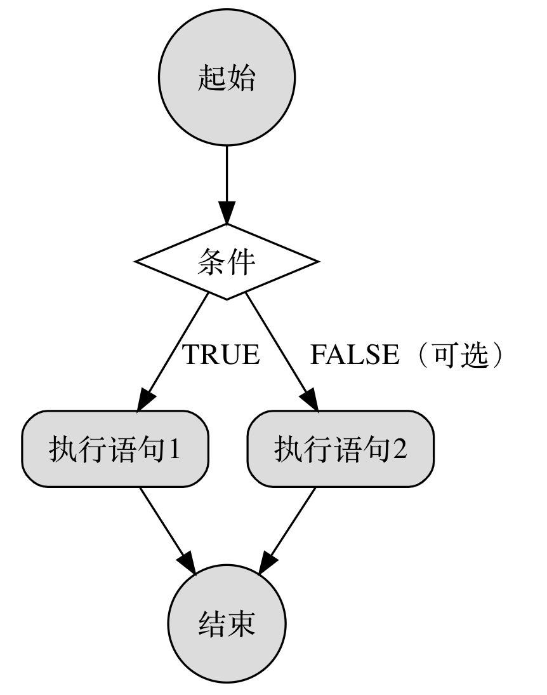
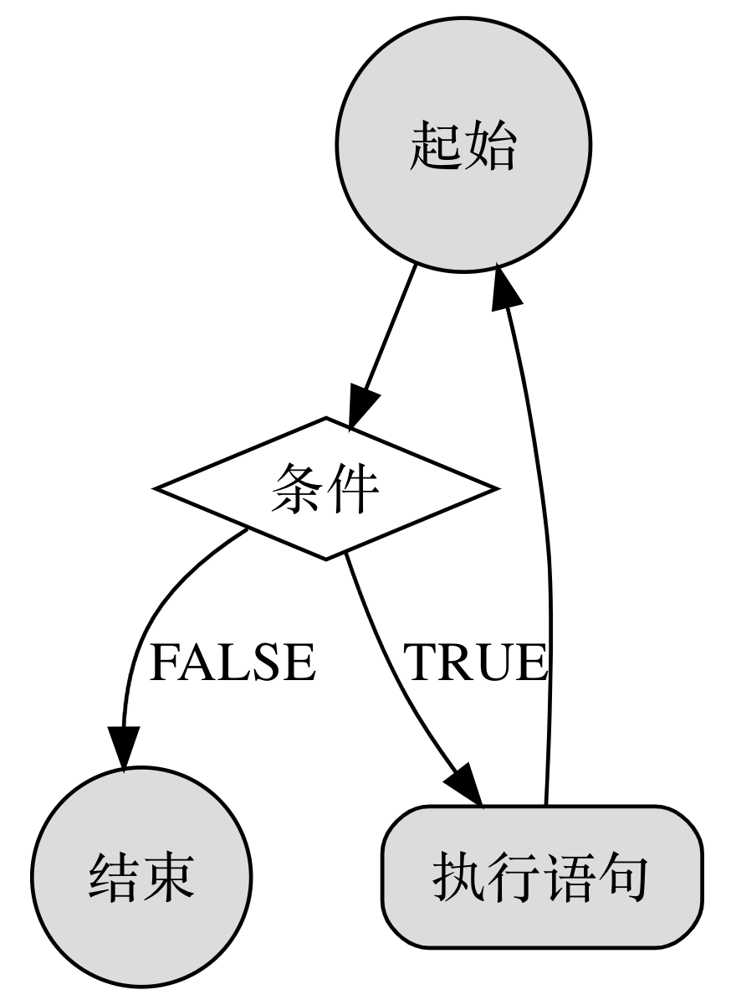
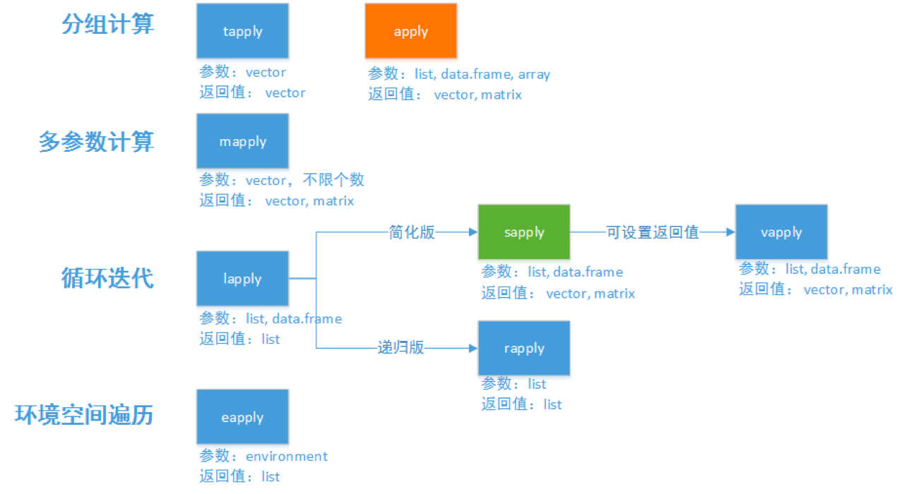

```{r setup, include = FALSE}

library(knitr)
library(tidyverse)
library(NHSRtheme)
library(icons)
library(fontawesome)
library(xaringanExtra)
library(emo)
# set default options
opts_chunk$set(echo = FALSE,
               fig.width = 7.252,
               fig.height = 4,
               dpi = 300)
xaringanExtra::use_tile_view()
xaringanExtra::use_panelset()
```

class: title-slide, left, bottom

# `r rmarkdown::metadata$title`
----
## **`r rmarkdown::metadata$subtitle`**
### `r rmarkdown::metadata$author`
### `r rmarkdown::metadata$date`

---

# 关于github classroom与作业提交

* 加入github classroom

* 分成5组，同学之间互相修改作业

* 小助教负责统计作业提交情况

* 关于课程录播

---

# 学习目标

--

* 流程控制语句与函数

--

* 数据读写与文件操作函数

--

* 命令行运行R

---

# 课前准备

- 下载数据[google.json](https://www.dropbox.com/scl/fi/0u6xqiwhtpelt3kd2wcx6/google.json?rlkey=oxskmls1c41g72de7590vdo42&dl=0)、[aminer文件](https://www.dropbox.com/scl/fi/k3j1nqjpp6qkg11m7nk39/1_1Yuanbo-Zhang_aminer.cnprofileyuanbo-zhang542a4624dabfae864af93d5f.csv?rlkey=2s7kcaeqloi8155s5uo0aqizh&dl=0)

---

# 流程控制

- R语言的基本构件（数据类型与数据结构）是盖楼使用的砖块。

- 流程控制语句是大楼的钢筋混凝土结构，构成了一段代码的骨架。

- 流程控制语句有两种：第一种是判断语句，第二种是循环语句。

---

# 条件判断

- 条件判断语句用于程序执行的走向，当条件判断为真时，执行一套语句；当条件判断为假时，执行另一套语句。

- R中有两种条件判断语句，`if..else`以及`switch`。

```{r 03-rbasic-if1, echo=FALSE, out.width='30%',cache=TRUE,fig.align='center'}

```

---

# if-else语句

```
if(条件){
  执行语句1
}else{
  执行语句2
}
```

通过对二分形式的拓展可以引入更加复杂的判断流程，可以在引入一个`if`判断便可以生成三个两个二分结构。

```
if(条件1){
  执行语句1
}else if(条件2){
  执行语句2
}else{
  执行语句3
}
```

---

```{r 03-rbasic-if2, echo=TRUE,eval=TRUE}
m <- 100
n <- 50
if(m > n){
  cat(m,"is lager than", n)#cat是文本输出函数
}
```

```{r 03-rbasic-if3,echo=TRUE,eval=TRUE}
if(m > n){
  cat(m,"is lager than", n)
}else if(m ==n){
  cat(m,"is equal to", n)
}else{
  cat(m,"is smaller than", n)
}
```

---

```{r 03-rbasic-if4, echo=FALSE, out.width='70%',cache=TRUE,fig.align='center'}

```

---

# switch函数

`switch`函数的第一种使用方法是使用数字作为条件语句，后续参数不限制数量，当条件语句为`n`时，返回第`n+1`个参数的结果。例如，

```{r echo=TRUE,eval=TRUE}
n <- 2
switch(n,"公共管理","经济学","数学")
```

`switch`函数的第二种使用方法是条件判断语句为字符串，后续参数的参数名对应前面字符串的潜在选择，参数值为参数名称对应的返回值。例如，

```{r echo=TRUE,eval=TRUE}
switch("史老师", 张老师 = "谁啊", 王老师 = "呵呵", 史老师 = "讲课可好玩了")
```

---

# 循环

循环语句用于执行重复性的操作，循环语句加判断语句就可以完成R里面绝大多数工作了。循环语句的基本逻辑是，当条件判断为真时，重复执行相应的执行语句，直到条件判断为假时，退出循环。


```{r 03-rbasic-loop1, echo=FALSE, out.width='30%',cache=TRUE,fig.align='center'}

```

---

# for循环

`for`循环使用指标迭代器作为判断语句，其结构为：

```
for(指标 in 迭代器){
  执行语句
}
```

一般来说，迭代器是一个向量，`for`循环执行的次数为迭代器的长度。例如，可以使用下面的代码输出前100个数字的求和。

```{r 03-rbasic-loop2,echo=T,eval=F}
n = 1
for(i in 0:99){
    n = n + i 
    print(n)
}
```

---

# while循环

while循环的条件语句是一个逻辑值，当逻辑判断为TRUE是，重复执行。

while循环不限制循环次数，因此，特别注意，需要人为设定跳出条件，否则循环将会无限循环（即死循环当中）。

```
i <- 1
while(i <= 9){
    j <- 1
    while (j <= i){
        cat(j, "*", i, "=", i*j, "\t",sep = "")
        j <- j + 1
    }
    cat("\n")
    i <- i + 1 
}
```

---

```
i <- 1
while(1){
    if(i>9){break}
    j <- 1
    while (j <= i){
        cat(j, "*", i, "=", i*j, "\t",sep = "")
        j <- j + 1
    }
    cat(“\n")
    i <- i + 1 
}
```

---

# repeat循环

上述循环的`while(1)`命令可以用更简洁的`repeat`命令替代

```
i <- 1
repeat{
    if(i>9){break}
    j <- 1
    while (j <= i){
        cat(j, "*", i, "=", i*j, "\t",sep = "")
        j <- j + 1
    }
    cat("\n")
    i <- i + 1 
}
```

---

# 函数

在编程的时候经常会重复自己的代码

- 不够简洁，移植性差，违反了一次原则

- 在重复过程中很容易出错，特别没有腔调，不优雅。

通过函数来将代码封装在一起实现类似的功能

编程时，将任务拆解成相互独立的模块，并将不同的模块定义成函数，可以降低程序的复杂性，增强可读性。同时，函数内部的局部变量只在函数运行时调用，避免了不同模块之间的交叉影响，符合正交原则。

---

# 函数的定义与调用

R语言通过`function`关键字来定义函数，具体定义方式如下：

```
function_name <- function(arg1, arg2,...) {
  return(result)
}
```

其中，function_name为自定义的函数名，arg1等为函数的参数，相当于是函数的自变量。函数的参数可以有任意多个，或者零个。`return`命令指定了函数的返回值，如果`return`命令时，以函数内表达式的最后一个表达式为返回值。

---

```{r 03-rbasic-fun1,echo=TRUE,eval=TRUE}
compare <- function(m,n){
  if(m > n){
  cat(m,"is lager than", n)
    }else if(m ==n){
  cat(m,"is equal to", n)
      }else{
  cat(m,"is smaller than", n)
        }
}
```

---

# 变量作用域

函数会把R语言占用的运算环境分成两个部分，函数外环境被称为全局环境，函数内环境被称为局部环境。

全局环境可以在Rstudio的“Environment”视窗中看到，使用`ls()`函数可以查看全局环境中的变量，使用`rm`函数可以删除相应的变量，`rm(list = ls())`会直接清空全局环境。

函数内局部环境中的变量被称为局部变量，函数定义时所有的局部变量都不会实际生成，只有在函数被调用时，局部变量才会生成，并且随着函数调用的结束释放。当局部变量与全局变量同名时，函数调用不会改变全局变量。

---

```{r 03-rbasic-env1, echo=TRUE,eval=TRUE}
global_x <- 1:3
f <- function(x){
  global_x <- x + 1
  cat('局部环境中global_x为',global_x,'\n')
}
f(2)
cat('全局环境中global_x为',global_x,'\n')
```

---

在函数内部如果要修改全局变量的值，用`<<-`代替`<-`进行赋值，例如

```{r 03-rbasic-env2, echo=TRUE,eval=TRUE}
global_x <- 1:3
f <- function(x){
  global_x <<- x + 1
  cat('局部环境中global_x为',global_x,'\n')
}
f(2)
cat('全局环境中global_x为',global_x,'\n')
```

注意，修改全局变量容易造成不易察觉的错误，一般情况下，不建议这样写代码。

---

# 函数模块化

函数模块化储存在`.R`文件中，可通过`source`函数在主代码中调用。

例如，我们将对处理组与对照组在变量`y`层面进行加权T检验的代码定义为函数`wttest`。将其储存为`wttest.R`文件。

```
library(weights)
wttest <- function(data, y){
    wtd.t.test(x = data[data$treat == 1,][y] %>% pull(1),
               y = data[data$treat == 0,][y] %>% pull(1),
               weight = data$weights[data$treat == 1],
               weighty = data$weights[data$treat == 0],
               samedata = FALSE)
}
```

在主代码中，可以通过`source`函数调用`wttest.R`中的`wttest`函数。

```
source("wttest.R")
```

---

# 包

R语言的强大之处在于其有一个全球的专业社区。其中`包`是社区成员将自己的代码贡献到社区的主要方式。R语言包是函数、实例数据、预编译代码的集合，包括R程序，注释文档、实例、测试数据等。

R语言包可以上传到CRAN平台，通过审核后，遍布在世界各地的R用户可以通过`install.packages`函数安装CRAN的包，并在代码中同构`library`函数加载。

```
install.packages(c("dplyr","readr","jsonlite"))
library(readr)
library(dplyr)
```

WSL2使用`sudo apt install r-cran-dplyr r-cran-readr r-cran-jsonlite`安装包，或者进入R之后使用`install.packages`安装。

---

# 向量化

R是一种解释型语言，在执行迭代循环时，能比编译型的速度相差几十倍；

对于大规模的迭代循环，可以通过将运算向量化来提高运算效率；

简单地讲，向量化就是一次性在一条`CPU`指令上处理多份数据；

`apply`函数家族进行向量化运算，其基本原理是将每一次迭代的执行语句封装成为一个函数，将被执行的数据（或者索引指标）存储在一个数据结构中，然后使用`apply`函数将该函数“应用”于特定的数据结构。根据被执行数据结构以及返回数据结构的不同，可以使用不同的`apply`函数。

---

```{r 03-rbasic-appl1, echo=FALSE, out.width='80%',cache=TRUE,fig.align='center'}

```

---

# apply

`apply`函数应用于矩阵和数据框，函数结构如下：

```
apply(X, Margin, Fun,…)
```

其中，X为数组、矩阵或数据框；Margin参数取值为1表示按行计算，取值为2表示按列计算；Fun为应用于运算的函数，可使用内置函数或自定义函数。


```{r 03-rbasic-appl2, echo=TRUE}
M <- matrix(1:10, ncol = 1)
apply(M,1,sum)
```

---

### lapply
`lapply`函数应用于list、data.frame数据集进行循环，并返回和X长度同样的list结构作为结果集。函数结构如下：
```{r lapply, echo=TRUE,eval=FALSE}
lapply(X, Fun,…)
```

### sapply
`sapply`是Simple lapply的缩写,相比与`lapply`增加了2个参数simplify和USE.NAMES。其结构为：
```{r sapply, echo=TRUE,eval=FALSE}
sapply(X, Fun,…,simplify=TRUE, USE.NAMES = TRUE)
```
其中，参数simplify表示是否数组化，当值array时，输出结果按数组进行分组。参数USE.NAMES表示如果X为字符串，TRUE设置字符串为数据名，FALSE不设置。

---

### vapply
`vapply`是在`sapply`基础上增加了一个FUN.VALUE参数，用来控制返回值的行名，这样可以让程序更灵活。
其结构为：
```{r vapply, echo=TRUE,eval=FALSE}
vapply(X, FUN, FUN.VALUE, ..., USE.NAMES = TRUE)
```

### mapply

`mapply`也是`sapply`的变形函数，类似多变量的`sapply`，但是参数定义有些变化。
```{r mapply1,echo=TRUE,eval=FALSE}
mapply(FUN, ...,MoreArgs = NULL, SIMPLIFY = TRUE,USE.NAMES = TRUE)
```

其中MoreArgs代表参数列表，例如
```{r mapply2,echo=TRUE,eval=FALSE}
mapply(rep, times = 1:4, x = 4:1)
mapply(rep, times = 1:4, MoreArgs = list(x = 42))
```

`tapply`、`rapply`以及`eapply`等，感兴趣读者可以通过官方文档阅读学习。

---

# 查看与修改路径

工作路径（working
directory）指的是R在系统做工作的位置，R会默认在工作路径中读入写出数据。初学者往往会忽略工作路径的设置，从而给代码和数据管理带来制造混乱，我们建议每个R项目都使用独立的工作路径。下面的组命令可以对工作路径进行查看与修改。

```
# 查看当前的工作路径
getwd()  
mypath = "~/myRworkingdir" 
# 为了确保路径存在，可以先查看其是否存在
file.exists(mypath)   
# 设定mypath为工作路径
setwd(mypath)
```

---

```
# 查看当前目录的子路径
list.dirs()             
# 查看当前目录的子目录和文件
dir()   
# 查看特定路径的子目录和文件
dir(mypath)  
# 列出目录下包括隐藏文件在内的所有的目录和文件
dir(mypath,all.files=TRUE)
# 只列出以字母R开头的子目录或文件
dir(mypath,pattern='^R')
# 查看当前目录权限
file.info(".")         
```

---

### 创建路径

```
# 在当前目录下，新建一个路径
dir.create("newdir")
# 递归创建一个3级子路径newdir1/newdir2/newdir3，使用recursive参数，直接创建会出错
dir.create(path="newdir1/newdir2/newdir3",recursive = TRUE)  
```

### 查看文件

R可以查看路径内文件的是否存在以及完整信息

```
# 检查文件是否存在
file.exists("myfile.txt")  
# 查看文件完整信息
file.info("myfile.txt")
# 查看文件访问权限
file.access("myfile.txt",0)
#判断是文件还是目录。-d 是目录返回ture，-f是文件会ture
file_test("-d", "myfile.txt")
```

---

### 创建、合并、复制文件

在R中也可以创建新的文件，并将内容写入该文件

```
# 创建一个空文件 output.txt
file.create("output.txt")
# 把相关的内容写入output.txt件中，若没有这个文件则创建文件并写入内容 
cat("output \n", file = "output.txt") 
# 合并文件,把文件output.txt的内容合并到myfile.txt
file.append("myfile.txt", "output.txt")
#把文件myfile.txt复制到文件output.txt
file.copy("myfile.txt", "output.txt")    
```

---

### 重命名文件与路径

使用file.rename函数可以重名工作路径或文件

```
# 将文件file重名名为newfile
file.rename("myfile.txt","mynewfile.txt")
# 将路径newdir重名名为newdir_rename
file.rename("newdir", "newdir_rename")    
```

### 删除文件

有两个函数可以使用file.remove和unlink，其中unlink函数还可以删除路径

```
# 删除前面创建的文件
file.remove("mynewfile.txt", "myfile.txt") 
# 删除文件
unlink("output.txt")
# 删除路径
unlink("newdir", "newdir_rename",recursive = TRUE)      
```

---
### 特殊路径

与R相关的有一些特殊路径，在debug和配置中会用到，此处列出。

-   `R.home()`可以查看R软件的相关路径

-   `.Library`可以找到R核心包的路径

-   `.Library.site`可以查看R核心包的目录和root用户安装包目录

-   `.libPaths()`可以查看R所有包的存放目录

-   `system.file()`可以查看指定包所在的目录

---

# 终端读写

- `readline`函数用于键盘读入数据，注意读入的数据为字符串。

- `cat`函数可以直接输出到文件

- `print`函数可以输出到屏幕

---

### 魔法数字的游戏

```
## magic number
# set.seed(345)
guessnumber <- function(n){
    guess <- readline(prompt = "Enter any number : ")
    guess <- as.numeric(guess)
    repeat{
        if(guess > n){
            print("The number is too large!")
            guess <- readline(prompt = "Enter any number : ")
            guess <- as.numeric(guess)
        }else if(guess < n){
            print("The number is too small!")
            guess <- readline(prompt = "Enter any number : ")
            guess <- as.numeric(guess)
        }else{
            cat("Congratulations! The number is",n, "!")
            break
        }
    }
}

# -----------------------------
n <- sample(1:100,1)
guessnumber(n)
```

---

# 数据文件

数据文件是连接不同代码之间的桥梁，是数据工程的钥匙。

  - 通用数据，不限于特定的编程工具，在程序世界中扮演着"通用货币"的角色，是可以跨语言跨工具使用的标准数据，例如txt,csv,xml,json, hdf5等；

  - 非通用数据，特定语言使用的数据，在一定程度上也可以跨语言使用，但是跨语言使用时经常伴随有信息的错误与损失，常见的非通用数据有dta(Stata),xls(MS
Excel),spv(SPSS), RData(R)等

  - RStudio在使用非通用数据时，可以从`Import Dataset`下拉菜单中选择相应的选项

---

## csv文件 

逗号分隔值（Comma-Separated Values）文本文件。以纯文本形式存储表格数据（数字和文本）。

`readr::read_csv`和`write_csv`函数对csv文件进行读写。

```{r echo=TRUE, eval=FALSE}
# install.packages('readr')
library(readr)
data <- read_csv('1_1Yuanbo Zhang_aminer.cnprofileyuanbo-zhang542a4624dabfae864af93d5f')
write_csv(data,"tmp.csv")
```

`write_csv`的append参数可以修改写出模式为添加。


---

## JSON文件

JASON(JavaScript Object
Notation,JavaScript)-Java对象表示法-是由道格拉斯·克罗克福特构想和设计、轻量级的数据交换语言，该语言以易于让人阅读的文字为基础，用来传输由属性值或者序列性的值组成的数据对象。如今已发展成为独立于特定语言之外的通用数据格式。

  - JSON由对象object与数组组成。对象(object)是一个对象包含一系列非排序的名称／值对(pair)，一个对象以`{`开始，并以`}`结束。每个名称／值对之间使用`:`分割。

  - 数组(array)：一个数组是一个值(value)的集合，一个数组以`[`开始，并以`]`结束。数组成员之间使用`,`分割。上面例子中`"ordinals"`对应的值便是一个数组。
  
  
R中可以使用**jsonlite**的`fromJSON`与`ToJSON`读写JSON文件，读入数据成为一个list

```{r json, eval=FALSE, echo=TRUE}
library(jsonlite)
google <- fromJSON("google.json",flatten = TRUE)
```

---

## 专用数据文件

R语言针对各类专用数据文件设计了读写借口，具体函数如下表：

| 数据格式 | 程序语言 | 函数 | 功能 |
|:------|:------|:------|:------|
| .RData   |  R    |  `load`   |  读入    |
| .RData   |  R    |  `save` ; `save.image`|  写出    |
| .dta    | STATA   | `haven::read_dta`|  读入     |
| .dta    | STATA   | `haven::write_stata`|  写出     |
| .sav    | SPSS     | `haven::read_sav`     |    读入     |
| .sav    | SPSS     | `haven::write_sav`     |    写出     |
| .sas  |  SAS    |  `haven::read_sas`     | 读入  |
| .xpt  |  SAS    |  `haven::read_xpt`     | 读入  |
| .xpt  |  SAS    |  `haven::write_xpt`     | 写出  |

---

# 命令行运行R

在命令行中运行R脚本，可以使用`Rscript example.R`的方式，其中`example.R`是脚本。

在Linux和Unix系统中，有一种更简洁的方式，即通过在脚本第一行添加`#! /usr/bin/env Rscript`的方式，来告诉操作系统这段脚本的要调用Rscript来运行。此时只要进入到`example.R`所在的路径中，使用命令`./exmaple.R`便可以直接运行这段代码。

另外，`!#`被称作Shebang，翻译过来就是"井号叹号"，上一次我听到这么草率的命名还是我办公室所在的"新建楼"。

---

## 读入参数

`commandArgs`函数可以从命令行读入位置参数。将下面脚本储存为文件add.r

```
#! /usr/bin/env Rscript

args = commandArgs(T)
m = as.numeric(args[1])
n = as.numeric(args[2])

print(m+n)
```

在命令行修改脚本的权限，为其添加可执行权限
```
sudo chmod +x add.r
```

运行加法器

```
./add.r 3 4
```

---
# 知识点

- 控制流程

- 函数与包

- 向量化

- 数据文件

- 数据读写

- 命令行运行


---

class: inverse,middle,center
# 所有语言都是数据类型、数据结构、控制流程、函数、数据读写的混合体
