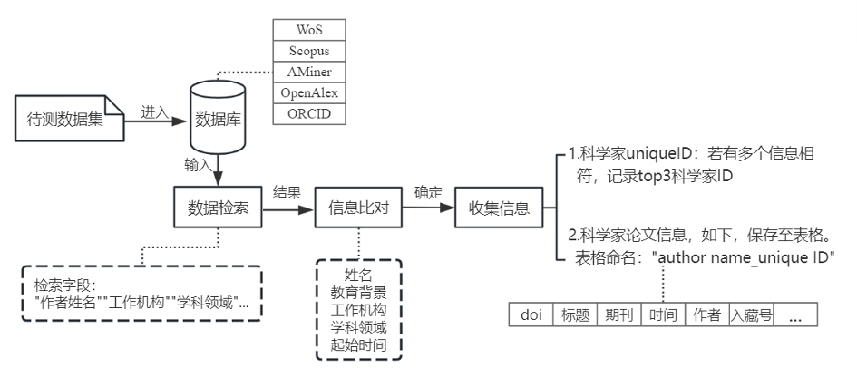
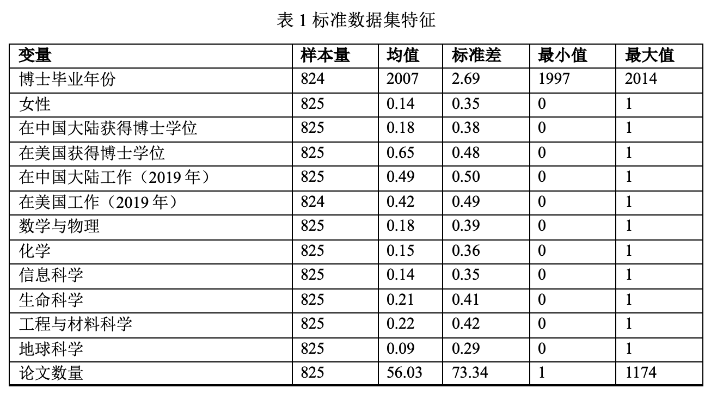
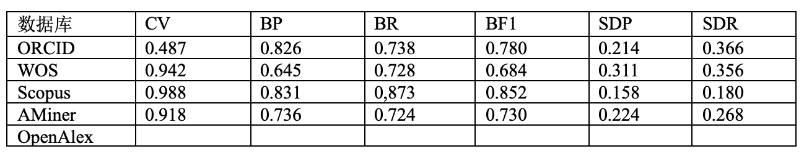
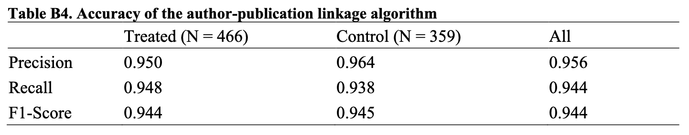
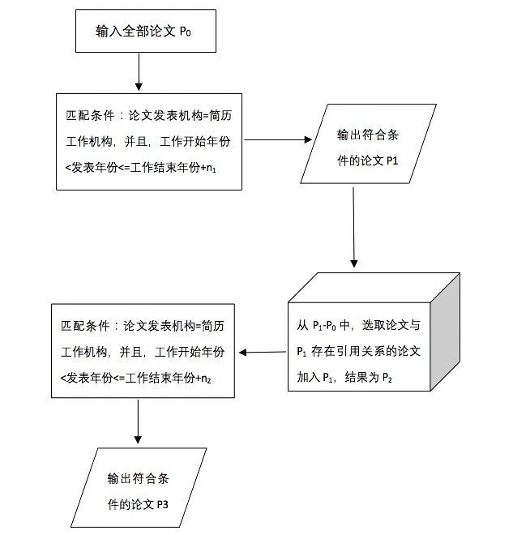

```{r setup, include = FALSE}
library(knitr)
library(tidyverse)
library(NHSRtheme)
library(icons)
library(fontawesome)
library(xaringanExtra)
library(emo)
library(reticulate)
use_python("/usr/local/bin/python")
# set default options
opts_chunk$set(echo = TRUE,
               fig.width = 7.252,
               fig.height = 4,
               dpi = 300)
xaringanExtra::use_tile_view()
xaringanExtra::use_panelset()
xaringanExtra::use_clipboard()
```

class: title-slide, left, bottom

# `r rmarkdown::metadata$title`
----
## **`r rmarkdown::metadata$subtitle`**
### `r rmarkdown::metadata$author`
### `r rmarkdown::metadata$date`

---
# 课前准备

- 使用到R语言dplyr、tidyr包

- 知识点：循环、表连接、正则表达式、字符处理函数
 
- 数据scientist.csv、cddt_paper.csv、cite.csv、inst_wos_dict.csv

---

# 学习目标

- 论文作者姓名歧义的问题与当前的解决思路

- 主要论文数据库的作者识别号的覆盖率、准确性

- 基于职业经历与引文网络的消歧算法

---

# 姓名歧义问题的重要性

--

- 以科学家、科研团队为研究单位的应用经济学研究，需要以科学家的发表记录为基础计算因变量

--

- 发表记录的准确性影响研究结论的信度

    - 错误估计系数大小
    
    - 错位估计系数方向

--

- 发表记录的代表性影响研究结论的效度

    - 基于高产科学家的样本企图得出适用于所有科学家的结论
    
--

- 这一问题的解决是科学经济学研究的基础设施（公地悲剧）

    - Torvik(2009) 一个算法支持了美国科学经济学的一大批经济学顶刊论文

---

# 姓名歧义问题的界定

--

- 确定作者署名相同或相近的两篇学术文献是否指向同一学者

--

- 一人多名问题，即同一个人由于名字的改变、姓名变体、输入错误或使用笔名等原因而出现多个不同的名字

--

- 一名多人问题，如何将姓名完全一样的研究人员的学术文献区分为不同自然人的文献

--

- 华人科学家的重名现象最为严重

    - 在华人排名前三的姓氏 “Wang”、“Zhang”、“Li”占据了人口总数21%
    
    - 华人姓名的拼音完全相同加重一名多人的问题
    
    - 统计WOS库凝聚态物理领域作者出现数量最多的前20名，有18名科学家为华裔姓名，包括 “Li, Wei”、 “Zhang, Lei” 、“Wang, Wei” 、“Zhang, Wei”等等

---

# 当前姓名消歧问题的解决思路

- 作者主动标注（实验室与个人主页、谷歌学术、ORCID、Researchgate）

    - 除ORCID外，其他来源无法直接与论文数据库连接，大量的人工成本
    
    - 覆盖率的问题，年轻的、高产的科学家、大陆高校与本土科学家不太重视

- 算法自动聚类
    
    - 监督算法（训练集直接影响算法的效果，例如openalex以orcid训练集）
    
    - 非监督算法（效果比较差）
    
    - 基于规则的算法（应用场景受限）
    
    - 大部分算法不开源代码和结果，需要大量计算资源

- 科技论文数据库的作者识别号，综合使用前两种方法

    - 使用便捷，在不同群体的覆盖率和准确性有待检验

---

# 科技论文数据库的作者识别号

```{r, echo=FALSE, out.width='100%',cache=TRUE}

```

---

```{r, echo=FALSE, out.width='100%',cache=TRUE}

```

---

<br/>
<br/>

```{r, echo=FALSE, out.width='100%',cache=TRUE}

```

还不清楚是否会影响研究结论，请关注后续的工作论文

---

# 回想一下我们是如何确认另一个人的论文的

--

- 工作单位与作者署名与科学家的简历要完全对应

    - Dongbo Shi; Shanghai Jiao Tong Univ, Sch Int & Publ Affairs, Shanghai 200030, Peoples R China; 2023
    
    - D Shi; Shanghai Jiao Tong Univ, Sch Int & Publ Affairs, Shanghai 200030, Peoples R China; 2023
    
    - Dongbo Shi; Heidelberg Univ, COS, D-69120 Heidelberg, Germany; 2023
    
---

- 研究话题（看上去）是匹配的

    - OBERON3 and SUPPRESSOR OF MAX2 1-LIKE proteins form a regulatory module driving phloem development
    
    - The minimum wage and the locations of new business entries in China: Estimates based on a refined border approach
    
    - Has China's Young Thousand Talents program been successful in recruiting and nurturing top-caliber scientists?
    
    - Changing carbon content of Chinese coal and implications for emissions of CO2
    

---

# 作者职业经历与引文网络的算法

- 全名署名、以及工作履历信息的配对，当同一个单位内部不存在同名科学家的时候是完全准确的，当同一个单位存在同名科学家的时候，（除了熟人）实际上是无法区分的

- 缩写署名不靠谱，不能简单当做全名署名处理

- 自我引用是普遍，可用于添加

- 研究话题信息不好利用：材料化学vs材料物理

---

# 算法的应用场景

- 以科学家个体为研究对象
    
    - 本来就需要收集科学家的个人经历
    
- 对数据质量要求高的研究（有重大影响的、开源数据的、有人会复现的）

- 使用到论文引文数据的研究

---

# 算法的优势

- 准确率高，扩展性强

```{r, echo=FALSE, out.width='70%',cache=TRUE,fig.align="center"}

```

- 所需计算资源小

- 有高水平期刊背书

---

# 算法思路

.pull-left[
```{r, echo=FALSE, out.width='100%',cache=TRUE,fig.align='center'}

```
]

.pull-right[

1. 利用全名署名与工作经历筛选论文

2. 通过引文关系添加缩写署名的论文

3. 通过工作经历再次筛选添加的论文

*存在延迟发表的情况，例如离开交通大学之后，我在交大的工作才发表出来*

]

---

# 算法的前期准备

- 标准化机构写法

    - 发现在学院、系的写法过于复杂，因此标准化学校、研究所层级
    
    - 降低精准度，配合人工检查

- 标准化机构在数据库中的地址写法

    - 正则表达式，例如uc berkeley; univ cal berkeley
    
    - inst phys, cas; cas, inst phys; chinese acad sci, inst phys
    
- 通过开源的方式提供数据，并开放维护

    - github仓库https://github.com/DongboShi/cvdisam

- 从Web of Science下载备选论文数据

- 下载备选论文间的引文关系

---

# 算法的R语言实现

代码的思路是函数只处理一个科学家，因此不需要科学家id

- 输入数据：cddt_paper::pid-pubyear-affiliation-initials

- 输入数据：cv::inst-startyear-endyear

- 输入数据: cite::citing_pid-cited_pid

- 输入数据：dict

---

## 函数

- 第一个函数使用dict来转换，根据数据库的类型定义转换表

- 第二个函数使用cv筛选

- 第三个函数通过引用添加一次操作，选出有引用关系的pid，循环放入主函数

- 第四个是主函数，完成所有的操作

---

```{r echo=TRUE,eval=FALSE}
inst_map <- function(cv,inst_dict,db = "wos"){
  if(db == "wos"){
    cv <- cv %>% inner_join(inst_dict %>% select(inst, wos) %>% distinct(),
                            by = "inst") %>%
      select(wos,startyear,endyear) %>% distinct()
  }else if(db == "scopus"){
    cv <- cv %>% inner_join(inst_dict %>% select(inst, scopus) %>%
                                distinct(),by = "inst") %>%
      select(scopus,startyear,endyear) %>%
      distinct()
  }else if(db == "openalex"){
    cv <- cv %>% inner_join(inst_dict %>% select(inst, openalex) %>%
                                distinct(), by = "inst") %>%
      select(openalex,startyear,endyear) %>%
      distinct()
  }else print("The database is not suppoted by now, please contact the authors in Github.")
  names(cv) <- c("inst","startyear","endyear")
  return(cv)
}
```

---

```{r, echo=TRUE, eval=FALSE}
cv_filter <- function(paper,cv,year_lag=2){
    paper <- paper %>%
    mutate(aff = str_to_lower(aff),
           pub_year = as.numeric(pub_year)) %>%
    filter()
    cv <- cv %>%
    mutate(inst = str_to_lower(inst),
           startyear = as.numeric(startyear),
           endyear = as.numeric(endyear))
    result <- paper %>%
        crossing(cv) %>%
        filter(pub_year >= startyear,
               pub_year <= endyear + year_lag,
               str_detect(aff,inst)) %>% #<<
        select(pid) %>% 
        distinct() %>% 
        pull(pid)
  return(result)
}
```

---

```{r echo=TRUE,eval=FALSE}
cite_glue <- function(pid,cite){
    pid_1 <- cite %>%
        filter(citing_pid %in% pid) %>%
        select(cited_pid) %>%
        distinct() %>%
        pull(1)
    pid_2 <- cite %>%
        filter(cited_pid %in% pid) %>%
        select(citing_pid) %>%
        distinct() %>%
        pull(1)

    pid_add <- unique(c(pid_1,pid_2))
    pid_add <- pid_add[!pid_add%in%pid]
    return(pid_add)
}
```

---

```{r echo=TRUE, eval=FALSE}
cv_disam <- function(paper, cv, year_lag1=2, year_lag2=2, cite){
  paper_1 <- paper %>% filter(initials == 0)
  paper_2 <- paper %>% filter(initials == 1)
  # 第一步筛选
  pid_stage1 <- cv_filter(paper_1, cv, year_lag1)
  cite <- cite %>% filter(citing_pid %in% c(pid_stage1,paper_2$pid),
                          cited_pid %in% c(pid_stage1,paper_2$pid))
  pid_core <- pid_stage1
  # 第二步循环添加
  while(1){
    pid_add <- cite_glue(pid_core,cite)
    if(length(pid_add)==0){break} else{
      pid_core <- c(pid_core, pid_add)}}
  pid_stage2 <- setdiff(pid_core,pid_stage1)
  # 第三步对pid_stage2使用cv筛选
  paper_3 <- paper_2 %>% filter(pid %in% pid_stage2)
  pid_stage3 <- cv_filter(paper_3, cv, year_lag2)
  pid_disam <- c(pid_stage1,pid_stage3)
  return(pid_disam)
}
```

---

```{r, echo=TRUE,eval=FALSE}
library(readr)
library(dplyr)
library(stringr)
scientist <- read_csv("scientist.csv")
inst_wos_dict <- read_csv("inst_wos_dict.csv")
cddt_paper <- read_csv("cddt_paper.csv")
cite_all <- read_csv("cite.csv")

scientist <- scientist %>% mutate(inst = str_to_lower(inst))
inst_wos_dict <- inst_wos_dict %>% mutate(inst = str_to_lower(inst))
cite_all <- cite_all %>% setNames(c("citing_pid","cited_pid"))
```

---
```{r, echo=TRUE,eval=FALSE}
result <- data.frame(uniqueID = vector(),pid = vector())
for(id in unique(scientist$uniqueID)){
  cv <- scientist %>% filter(uniqueID == id)
  cv <- inst_map(cv = cv,inst_dict =inst_wos_dict)
  paper <- cddt_paper %>%
    filter(uniqueID == id) %>%
    filter(item_type == "Article") %>%
    mutate(initials = as.numeric(type == 2)) %>%
    rename(pid = ut_char,aff = addr) %>%
    select(pid, aff, pub_year, initials) %>%
    distinct()
  cite <- cite_all %>% filter(citing_pid %in% paper$pid, 
                              cited_pid %in% paper$pid)
  pid_disam <- cv_disam(paper, cv, year_lag1 = 2, year_lag2 = 2, cite)
  result <- rbind(result,data.frame(uniqueID = id, pid = pid_disam))
  print(id)
}
```

---

欢迎大家引用

刘玮辰,史冬波,李江.基于职业经历和引文网络的华人姓名消歧算法[J].信息资源管理学报,2020,10(06):82-89+100.DOI:10.13365/j.jirm.2020.06.082

Dongbo Shi et al. ,Has China’s Young Thousand Talents program been successful in recruiting and nurturing top-caliber scientists?.Science379,62-65(2023).DOI:10.1126/science.abq1218

---

# 课后作业

- 将本算法在Python中实现

---

class: inverse,middle,center
# 能解决问题的算法才是好算法
