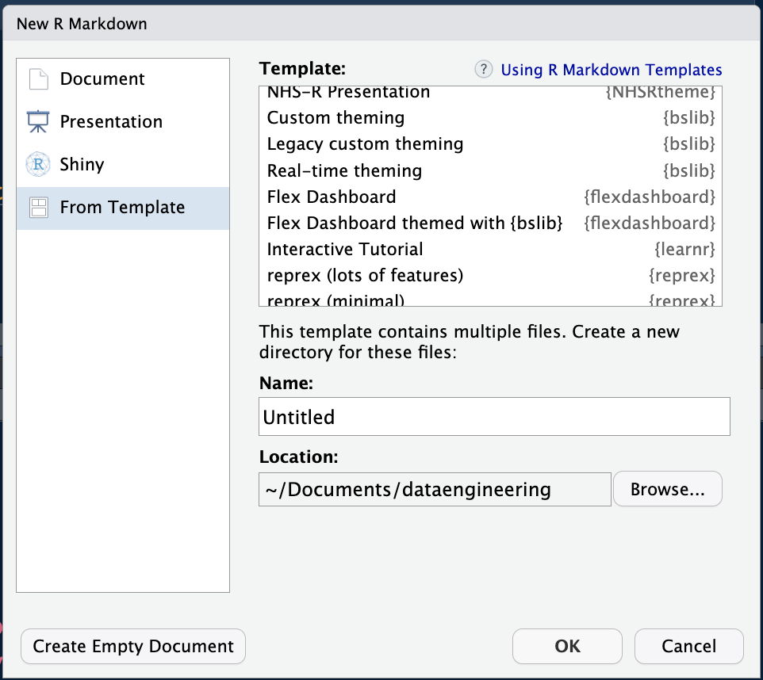
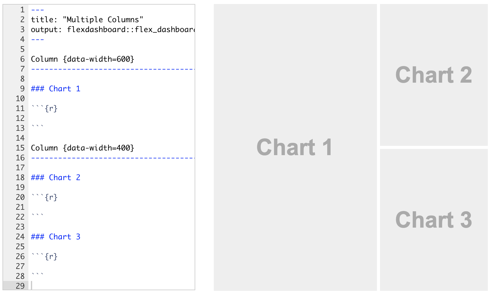

```{r setup, include = FALSE}
library(knitr)
library(tidyverse)
library(NHSRtheme)
library(icons)
library(fontawesome)
library(xaringanExtra)
library(emo)
library(reticulate)
use_python("/usr/local/bin/python")
# set default options
opts_chunk$set(echo = TRUE,
               cache = FALSE,
               fig.width = 7.252,
               fig.height = 4,
               dpi = 300)
xaringanExtra::use_tile_view()
xaringanExtra::use_panelset()
xaringanExtra::use_clipboard()
```

class: title-slide, left, bottom

# `r rmarkdown::metadata$title`
----
## **`r rmarkdown::metadata$subtitle`**
### `r rmarkdown::metadata$author`
### `r rmarkdown::metadata$date`

---
# 课前准备

- 使用到R语言ggpubr,ggsci,ggthemes,scales,NHSRtheme,ggplotly,gganimate,flexdashboard,colorspace包

- `install.packages('remotes')`

- `remotes::install_github('nhs-r-community/NHSRtheme')`
 
- 数据pub_211.csv、EconomistData.csv

---

# 学习目标

- ggpubr组合图形

- 调色板

- gganimate制作动图

- ggplotly制作交互图

- flexdashboard制作大屏

---

# 图形组合

使用`ggpubr`包中的`ggarrange`函数来完成图形组合

- 被组合的图形，依次作为参数输入函数

- 并使用`nrow`和`ncol`指定组合的行与列，`labels`参数为子图指定标签。组合图形会自动对齐坐标轴

```{r, echo=TRUE,message=FALSE}
economist <- read_csv("data/08/EconomistData.csv")
```

---

```{r, echo=TRUE,message=FALSE}
p1 <- ggplot(economist, aes(x = CPI, y = HDI,color = Region)) + 
  geom_point(shape = 21,size = 3,fill = "white",stroke = 1.5) +
  geom_smooth(method = "lm",color = "red",formula = y~ poly(x, 2),se = FALSE) + 
  scale_x_continuous("Corruption Perceptions Index, 2011 (10 = least corrupt)",breaks = 1:10,limits = c(1,10.2),expand = c(0,0)) +
  scale_y_continuous("Human Development Index, 2011 (1 = best)",breaks = seq(0.2,1,0.1),limits = c(0.2,1.0)) + 
  scale_color_discrete(labels = expression(paste(R^2, "= 56%"))) + #<<
  scale_color_manual(values=c("#014d64","#01a2d9","#7ad2f6","#00887d","#ee8f71","#7c260b"),
                     labels=c("Americas","Asia Pacific",
                              "East Europe & Central Asia",
                              "West Europe","East Asia",
                              "South Asia")) +
    labs(title = "Corruption and human development",
       caption = "Source: Transparency International; UN Human Development Report") +
    guides(colour = guide_legend(title = element_blank()),
         linetype = guide_legend(title = element_blank())) 

p2 <- ggplot(economist, aes(x = CPI, y = HDI)) + stat_summary(fun = mean, geom = "col")
p3 <- ggplot(economist, aes(x = Region, y = HDI)) + stat_summary(fun = mean, geom = "col") +
    scale_x_discrete(labels = c("AM","APE","EECA","EUEP","MENA","SSA"))

```


---

```{r,echo=TRUE}
mytheme <- theme(panel.background = element_rect(fill = "white"),
        panel.grid.major.y = element_line(color = "grey",linetype = "solid"),
        panel.grid.major.x = element_blank(),
        axis.line.x = element_line(color = "black"),
        axis.text.x = element_text(color = "black",size = 8),
        axis.ticks.length.x = unit(-0.2, "cm"),
        axis.ticks.length.y = unit(0.5, "cm"),
        axis.ticks.y = element_line(color = "grey"),
        axis.text.y = element_text(color = "black",size = 8),
        axis.title = element_text(face = "italic",size = 8),
        plot.caption.position = "plot",
        plot.caption = element_text(hjust = 0,size = 8),
        legend.position = "top",
        legend.box = "horizontal",
        legend.title = element_blank(),
        legend.key = element_blank(),
        legend.justification=c(0.45,1)) 
```

---

```{r echo=TRUE,message=FALSE,out.width='75%',fig.align="center"}
p4 <- p1 + mytheme + guides(colour = FALSE, linetype = FALSE)
p5 <- p2 + mytheme
p6 <- p3 + mytheme + theme(axis.text.x = element_text(color = "black",size = 9))
print(p4)
```

---

```{r echo=TRUE,message=FALSE,out.width='75%',fig.align="center"}
print(p5)
```

---

```{r echo=TRUE,message=FALSE,out.width='75%',fig.align="center",eval=FALSE} 
library(ggpubr)
figure <- ggarrange(p4, p5, p6, 
          labels = c("A", "B", "C"),
          ncol = 1, nrow = 3)
print(figure)
```

---

```{r echo=F,message=FALSE,out.width='100%',fig.align="center"} 
library(ggpubr)
figure <- ggarrange(p4, p5, p6, 
          labels = c("A", "B", "C"),
          ncol = 1, nrow = 3)
print(figure)
```

---

```{r echo=F,message=FALSE,out.width='100%',fig.align="center",eval=T} 
figure <- ggarrange(p4,ggarrange(p5, p6,ncol=1, labels = c("B","C")),labels = "A", ncol=2)
print(figure)
```

---

`annotate_figure`函数可以用于为组合后的图形添加注释

```{r, warning=FALSE,echo=TRUE,warning=FALSE,eval=FALSE}
annotate_figure(figure,
                top = text_grob("Visualizing mpg", color = "red", face = "bold", size = 14),
                bottom = text_grob("Data source: \n mtcars data set", color = "blue",
                                   hjust = 1, x = 1, face = "italic", size = 10),
                left = text_grob("Figure arranged using ggpubr", color = "green", rot = 90),
                right = "I'm done, thanks :-)!",
                fig.lab = "Figure 1", fig.lab.face = "bold")
```

- `ggpubr`为制作可发表的图形，还提供了诸多函数，例如，`ggtexttable`可以将表格变成图形对象；`ggparagraph`将文本变成图形对象

- 更多内容阅读官方文档，<https://rpkgs.datanovia.com/ggpubr>

---

```{r, warning=FALSE,echo=FALSE,warning=FALSE,eval=TRUE}
annotate_figure(figure,
                top = text_grob("Visualizing mpg", color = "red", face = "bold", size = 14),
                bottom = text_grob("Data source: \n mtcars data set", color = "blue",
                                   hjust = 1, x = 1, face = "italic", size = 10),
                left = text_grob("Figure arranged using ggpubr", color = "green", rot = 90),
                right = "I'm done, thanks :-)!",
                fig.lab = "Figure 1", fig.lab.face = "bold"
)
```

---

# 调色板

- 选择优雅的颜色是高质量数据可视化的保障

- 艺术造诣和编程能力并不是互斥的技能点

- `ggsci`提供了多种杂志的配色方案

- `NHSRtheme`提供了英国国民保健署的一套配色方案

- `colorspace`提供了通用配色模板

---

查看并使用经济学人杂志的调色板

```{r echo=TRUE,message=FALSE,out.width='40%',fig.align="center"}
library(ggthemes)
library(scales)
library(ggsci)
show_col(economist_pal()(9))
economist_pal()(9)
```

---

science杂志的配色
```{r out.width='50%',fig.align="center"}
show_col(pal_aaas()(9))
pal_aaas()(9)
```

---

```{r out.width='70%',fig.align="center",message=FALSE}
p4 + scale_color_aaas()
```

---

```{r out.width='70%',fig.align="center",message=FALSE}
# install.packages('remotes')
# remotes::install_github('nhs-r-community/NHSRtheme')
library(NHSRtheme)
p4 + scale_colour_nhs()
```

---

### colorspace

colorspace包中共包括三种类型的配色模板——Qualitative、Sequential、Diverging，可以使用`hcl_palettes`查看全部配色或某一类型配色

```{r out.width='50%',fig.align="center",message=FALSE}
library(colorspace)
hcl_palettes(plot = TRUE)
```

---

```{r out.width='70%',fig.align="center",message=FALSE}
hcl_palettes("sequential (single-hue)", n = 10, plot = TRUE) # n表示展示的颜色数量
```

---
<br/>

通过`_hcl`函数可以查看相应类型中的颜色十六进制代码，也可以通过`swatchplot`函数进行可视化

```{r echo=TRUE}
diverging_hcl(n = 7, "Broc")
```

---

```{r out.width='70%',fig.align="center",message=FALSE}
p4 + scale_color_discrete_qualitative(palette = "Pastel1")
```

---

# 交互图

`plotly`扩展包可以将`ggplot2`图以交互图的形式展示

```{r out.width='100%',fig.align="center",message=FALSE,warning=FALSE}
library(plotly);ggplotly(p4,height = 400)
```

---

# 动图

`gganimate`是基于`ggplot2`的制作动图的扩展包

- 动图的原理是逐帧画图，然后通过转换设置将每一帧图连续展示

- `anim_save`命令用于将动图储存为`.gif`文件

```{r, echo=TRUE, message=FALSE}
library(gifski)
library(gganimate)
pub_211 <- read_csv("/Users/birdstone/Library/CloudStorage/Dropbox/bigdata_econ_2023/data/pub_211.csv") %>% 
    filter(cnsubject == "0202 应用经济学",pubyear < 2022)
pub_211 <- pub_211 %>% group_by(pubyear) %>% 
    arrange(desc(pubnum)) %>% 
    mutate(rank = row_number()) %>% 
    ungroup() %>% filter(rank <= 10) %>% 
    mutate(rank = 11 - rank,pubyear=as.integer(pubyear))
```

---

```{r, echo=TRUE,message=FALSE,eval=FALSE}
anim <- ggplot(pub_211) +
    geom_col(aes(x=rank, y = pubnum,group=inst_cn, fill=inst_cn), width=0.4) +
    geom_text(family='SimSun',aes(x = rank, y=0,label=inst_cn, group=inst_cn),
              #position = 'dodge',
              hjust = 1) +
    theme_minimal() +
    ylab("Number of appled economics papers") +
    guides(fill = "none") + 
    theme(axis.title.y = element_blank(),
          axis.text.y = element_blank(),
          axis.ticks.y = element_blank(),
          plot.margin = unit(c(4,4,4,4),'lines')) +
    coord_flip(clip='off') + 
    ggtitle('{closest_state}') +             # title with the timestamp period
    transition_states(pubyear,
                      transition_length = 1,
                      state_length = 2) +
    exit_fly(x_loc = 0, y_loc = 0) +         # chart exit animation params
    enter_fly(x_loc = 0, y_loc = 0)
animate(anim,duration=20)
anim_save("econpubrank.gif")
```


---

```{r eval=TRUE, echo=FALSE, message=FALSE,warning=FALSE,out.height='120%'}
anim <- ggplot(pub_211) +
    geom_col(aes(x=rank, y = pubnum,group=inst_cn, fill=inst_cn), width=0.4) +
    geom_text(family='SimSun',aes(x = rank, y=0,label=inst_cn, group=inst_cn),
              #position = 'dodge',
              hjust = 1) +
    theme_minimal() +
    ylab("Number of appled economics papers") +
    guides(fill = "none") + 
    theme(axis.title.y = element_blank(),
          axis.text.y = element_blank(),
          axis.ticks.y = element_blank(),
          plot.margin = unit(c(4,4,4,4),'lines')) +
    coord_flip(clip='off') + 
    ggtitle('{closest_state}') +             # title with the timestamp period
    transition_states(pubyear,
                      transition_length = 1,
                      state_length = 2) +
    exit_fly(x_loc = 0, y_loc = 0) +         # chart exit animation params
    enter_fly(x_loc = 0, y_loc = 0)
animate(anim,duration=20)
anim_save("econpubrank.gif")
```
---

# 数据大屏Dashboard

数据大屏Dashboard用于集中展示数据可视化的成果

- `R`中的`Shiny`包可用于制作炫酷的数据大屏。

- 但是这要求了解HHTML语言，我们后会在爬虫之后介绍

- `flexdashboard`包支持使用`Rmarkdown`语法制作数据大屏，已经可以满足绝大多数的大屏需求


---

## flexdashboard安装

```{r, eval=FALSE}
install.packages("flexdashboard")
```

---

## 新建dashboard

安装完成后，可以在`New File->Rmarkdown->From Template`中看到`flexdashboard`模板，选择创建。

```{r, echo=FALSE, out.width='50%',cache=TRUE,fig.align="center"}

```

---

## dashboard布局

在flexdashboard中，使用三级markdown标题来标记不同的组成部分，通过制定属性的方式来设置组成部分的尺寸

```{r, echo=FALSE, out.width='60%',cache=TRUE,fig.align="center"}

```

---

## 学习方式

- 对于大屏、幻灯片、网页布局等最好使用别人的模板进行学习

- 不要试图从原理上全部掌握，效率很低

- https://pkgs.rstudio.com/flexdashboard/articles/examples.html

---

# 课后作业

- 使用pub_211.csv制作一个数据大屏

---

class: inverse, middle, center
# 好研究首先是好看的研究
